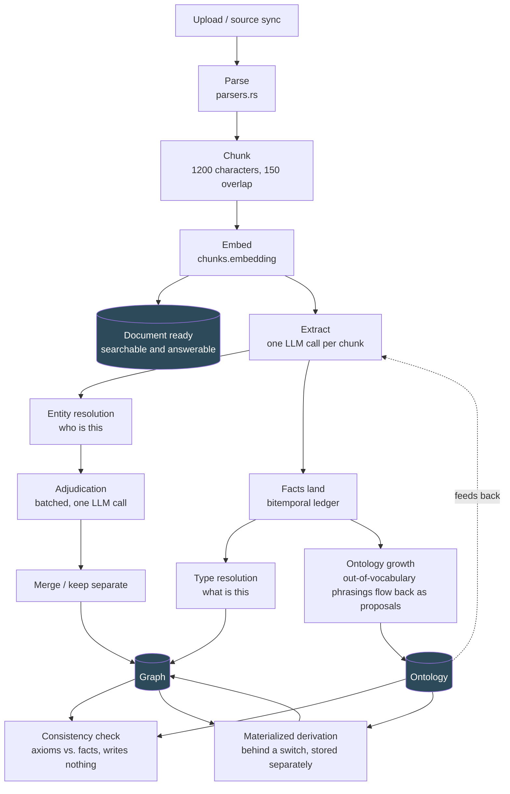
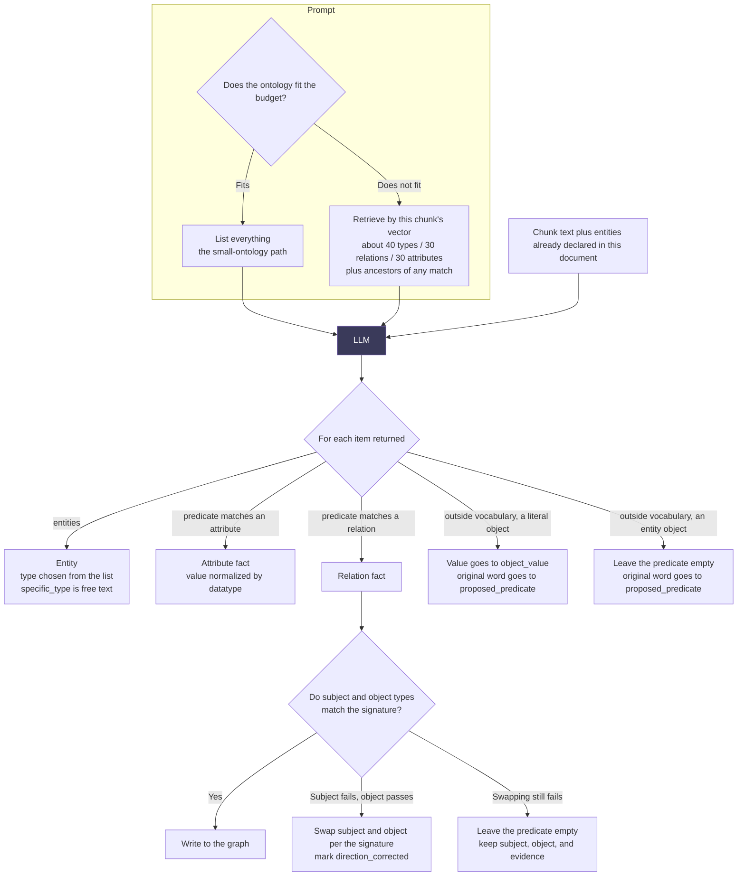
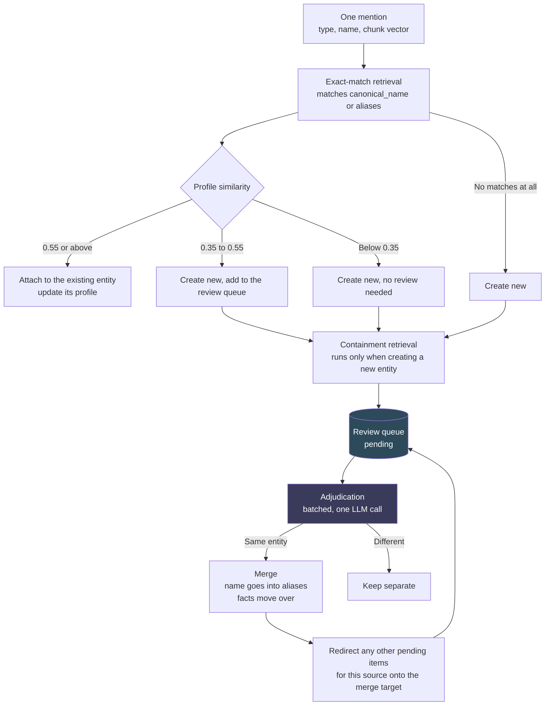
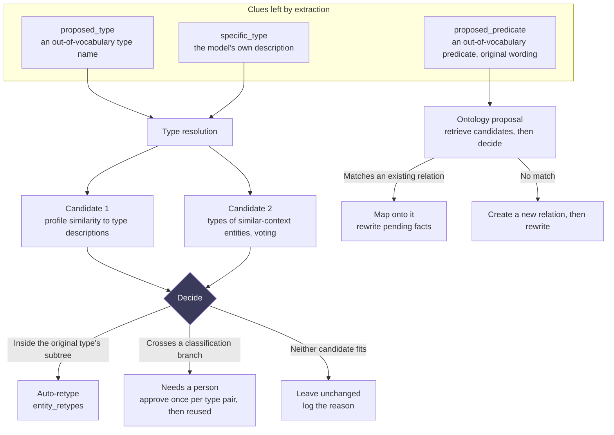

# How a document becomes a graph

**This document does not explain why. It explains how data flows.** The reasoning behind "why this, not that" lives in [decisions/](decisions/README.md). This document answers a different question: **where does the line you are editing sit in the pipeline, what does it receive from upstream, and what happens downstream if you do not pass something on.**

> The most valuable thing on a diagram is not the arrows. It is **where an arrow breaks.** Each section ends with "does anything get lost here," listing real discard points that exist in the code and where they land in the database — not "this could theoretically fail," but **the specific cases you can already count in `extraction_drops`.**

## Overview



**The two-stage design is deliberate**: a document becomes `ready` as soon as embedding finishes, so search and chat work immediately, while extraction queues in the background. A long document's graph takes minutes to fully form, but the document is searchable within seconds.

**The dotted feedback line from the ontology is this system's loop**: extraction uses the ontology; when extraction meets a phrasing the ontology does not have, it records the original word; a proposal flows back into the ontology; the next batch of documents extracts using the updated vocabulary. See [0003](decisions/0003-ontology-growth-loop.md).

**Where the ontology starts**: a new base seeds nothing. It starts from an optional pack (schema.org is checked by default; W3C Org, PROV-O, FOAF, and IOF Core are also available), or a user's own imported OWL file, or nothing at all — an empty base can still extract; an entity with no type is simply an entity with no type. See [0008](decisions/0008-ontology-packs-as-cold-start.md) and [0009](decisions/0009-no-type-is-a-type.md).

**The two boxes at the bottom are the ontology's axioms doing real work**: the consistency check writes nothing to `facts`; it only surfaces contradictions (shown in Review under two tabs, violations and defects). Materialized derivation is off by default; once on, a derived fact is stored in a separate table, drawn in gold on the graph, and never closes an asserted fact. See section four below.

---

## 1. Extracting one chunk



**`specific_type` is the output most easily overlooked at this step**: free text, not validated, never stored in the ontology — just the model's own description of the entity ("vector database software"). Type resolution depends on it to turn the task from "understand what this is" back into "which type in the ontology has this name." Without it, in one test, all 17 entities' `proposed_type` came back empty — the type list always had something "close enough," the model picked it, and the more accurate description in its head was lost.

**Neither out-of-vocabulary path throws anything away**: a phrasing with a literal value goes to `object_value` (instead of inventing an entity named "2015" out of nothing); a phrasing with an entity object **leaves the predicate empty** — not downgraded to a relation named "related to," since that would be a claim, not an admission of uncertainty ([0010](decisions/0010-no-relation-is-no-relation.md)). Both cases keep their original wording in `fact_evidence.proposed_predicate`, recovered for display by `fact_surface_predicate()`.

**A matched relation still passes through a signature check**: the ontology might declare `employee (organization → person)`, and the model can still write `Musk employee Microsoft` anyway — three rounds of prompt wording could not fully suppress this; the English phrase "X is an employee of Y" pulls too strongly. So direction is corrected at write time: if the subject fails the domain check but the object passes, swap them — **never silently**, always leaving a `direction_corrected` trace. If swapping still fails (`OpenAI affectedBy …`, where schema.org's `affectedBy` is a medical-test term), drop the predicate and keep subject, object, and evidence. Argument order is an encoding convention for the fact's key, not a claim about the world, so the ontology enforces it here. See [0012](decisions/0012-the-ontology-is-a-contract-not-a-suggestion.md).

### Does anything get lost here

Yes. Twelve discard reason codes, all recorded in `extraction_drops`, all visible in the UI (one of them is not a discard at all, it is a trace left on purpose):

| Reason | When it happens |
|---|---|
| `truncated_reply` | The model's output was cut off; the whole chunk is discarded |
| `malformed_item` | One fact is badly formed — **only that fact is discarded**, not the whole chunk (#127) |
| `not_an_entity_name` | An "entity name" is actually a full sentence (judged by word count plus a finite verb, #143) |
| `low_confidence` | The model's self-reported confidence is below the threshold |
| `subject_not_declared` | The subject was never declared in `entities` — logged on **both** the relation and attribute paths |
| `attr_domain_mismatch` | An attribute was attached to a type outside its domain (checked all the way up the parent chain) |
| `attr_no_value` / `attr_datatype` | An attribute fact has no value, or the value cannot convert to its declared datatype |
| `object_missing` | A relation fact has no object |
| `direction_corrected` | **Not a discard**: subject and object were swapped to match the signature, recorded so it is never silent |
| `domain_mismatch` | Swapping still failed to satisfy the ontology; the predicate was dropped (subject, object, and evidence are kept) |

**`attr_domain_mismatch` is the most costly one**: it is discarded at the moment of writing, and a later type correction cannot recover it — the fact was never written in the first place, and only a re-extraction can fix it.

One older reason code, `fallback_relation_missing` (the whole fact vanishing when the fallback relation itself had been deleted), no longer exists — it was removed along with `related_to`.

---

## 2. Entity resolution: who is this



**Three thresholds, three tiers** (`SIM_ATTACH = 0.55`, `SIM_NEW = 0.35`): a clear match attaches; a possible match creates a new entity and queues it for review; a poor match creates a new entity with no review needed. **Prefer separate over merged** — a wrong merge mixes two entities' facts together, a far more expensive mistake than one extra entity.

**Containment retrieval** ("Holmes" ⊂ "Sherlock Holmes") closes a gap exact matching cannot: prefixes cannot be enumerated in advance, and a shortened name can silently become a second entity. It carries three limits: the shorter name must be at least 4 characters (below that, most names are too generic), at most 4 pairs are produced per run, and the SQL side over-fetches by 16 rows (a hard type mismatch can only be filtered out later, on the Rust side).

**Redirecting pending items is the least intuitive step in this whole flow, and also the easiest one to break by mistake**: after a merge, any other pending review items involving the merged entity **cannot simply be closed** — they must redirect to the merge target instead. The reasoning is below.

### This step fixed three bugs, all found by the same corpus

Running the first six stories of "The Adventures of Sherlock Holmes" (`scripts/bench/corpora/holmes.json`) four times in a row, fixing one layer each time:

| | Original | Same-type fix | Alias retrieval added | Redirect added |
|---|---|---|---|---|
| Entities merged | 14 | 37 | 47 | **57** |
| "Holmes" merged in | No | Yes | Yes | Yes |
| "Mr. Holmes" merged in | No | No | No | **Yes** |

**First layer**: `classify_type_drift` had no case for "the two types are identical" — `person × person` fell into `Disjoint` ("can never be the same"). That function was built to catch "type drift" (the same name extracted as two different types), a case where the two types are never equal by design. Later, containment retrieval reused it as a compatibility check, where **two identical types is the common case.** Not one of the clearest same-entity pairs in the whole text ever reached the review queue — all twelve existing unit tests only covered cross-type cases.

**Second layer**: retrieval only checked `canonical_name`. Merging moves a name into `aliases`, so **every successful merge tears down one bridge**: once "Holmes" merged in, the later mention "Mr. Holmes" no longer shared a containment relationship with "Sherlock Holmes" — the bridge that used to connect them, "Holmes," was gone. Fixing the first layer only exposed the second.

**Third layer**: a merge closed any other pending review items involving the merged entity as `superseded by merge`, with a code comment reasoning "if the doubt is still real, a later mention will raise it again." **That reasoning was wrong**: containment retrieval only runs when creating a new entity, and these entities already existed — they would never be created again. Closing them meant closing them permanently. The fix redirects them to the merge target instead, closing only the truly outdated ones — a pair that became a self-loop after redirecting, or a pair already sitting in the queue.

**Each layer depended on the one before it**: the second layer was invisible until the first was fixed; the third was invisible until the second was fixed. The value of a benchmark corpus is not in the first number it produces — it is that **fixing one layer reveals the next one.**

### Does anything get lost here

No facts are lost, but it can **leave entities separate that should have merged.** Two known gaps:

- Two names that neither contain each other nor share an alias bridge (e.g., "Qiming X7 accelerator card" vs. "Qiming X7 inference accelerator card"). Fixing this needs trigram similarity, and `CREATE EXTENSION pg_trgm` requires superuser privileges, while this project connects as a restricted role.
- Containment retrieval caps at 4 pairs per run — a generic name might be contained in dozens of entities, and returning all of them would flood the queue.

A merge itself is **always reversible** (`entity_merges` records everything needed to restore the prior state; `revert_merge` reverses it).

---

## 3. Type resolution: what is this



**Two candidate sources are combined as a union, never scored together.** Distance is not comparable in three separate ways: not across entities (a distance of 0.46 for one pair can be closer than 0.59 for a far more obviously correct pair), not between the two candidate sources (type-space vs. entity-space), and not even between two queries on the same source (a short query systematically produces smaller distances than a full profile paragraph). **Always alternate between sources; never merge by score.**

**Tiers are not set from the model's self-reported confidence** — measured values were bimodal (mostly at 0.85+ or null, with nothing in between), meaning self-reported confidence is a tone, not a probability. Instead: **is the chosen type inside the coarse type's subtree?** Inside means one step down, automatic; outside means a different branch of classification, sent to a person.

**A correction also goes through a person, by design**: extraction already retrieves and picks a candidate type per chunk, and it does get this wrong (labeling a place name as an address type, for example); the correct answer is often a **sibling** of the wrong type, not a descendant, so it is always judged as crossing a branch. Overturning an earlier extraction decision carries more risk than refining it, and should never happen automatically.

### Does anything get lost here

No facts are lost, but **a retype does not appear on the timeline** — it is one `UPDATE` to `entities` plus one row in `entity_retypes`; entity history only reads `facts`. So a wrong retype does not surface on its own — reversible is not the same as reversed, which is why a preview step runs before apply.

**Type resolution today only runs manually** — a preview-then-apply flow on the ontology page, with no automatic trigger anywhere. Extraction only queues ontology growth and entity adjudication. So at ontology scale, refining a newly created entity's type depends on a person remembering to click a button — a real gap ([0001](decisions/0001-ontology-import-and-governance.md) P3a).

**A type a person already decided on is not reconsidered by the engine.** An entity with `entities.type_source = human` is excluded from type resolution's input, including the case of "a person decided this has no type" ([0001](decisions/0001-ontology-import-and-governance.md) P4a).

**A rejection must state a reason.** `left_alone` used to be a bare count, and this whole design bets on "choosing 'none of these' is a respectable answer" — the largest, least transparent bucket. Once the reason was logged, the first run answered a question that could not be answered before: failures were entirely on the retrieval side, not in the decision step.

---

## 4. Axioms: checking and deriving

```mermaid
flowchart TB
    ONT[(Ontology axioms<br/>functional, symmetric, asymmetric<br/>transitive, inverseOf, subPropertyOf, disjoint)] --> SELF[Ontology self-check<br/>8 defect types]
    SELF --> DEF[(ontology_defects)]
    ONT --> R0[Fact-level check<br/>self-loop, asymmetry, cycle, cardinality]
    G[(Graph)] --> R0
    R0 --> VIO[(axiom_violations<br/>with the full path)]
    VIO --> DEC{A person decides}
    DEC -->|Retract the fact| RET[The fact is retired]
    DEC -->|Relax the axiom| RLX[The ontology changes]
    DEC -->|Accept| ACC[Both stay]
    ONT --> R1{materialize_inferences<br/>a switch, off by default}
    G --> R1
    R1 -->|On| DER[(derived_facts<br/>a separate table, rule_id, a premise chain)]
    DER --> GV[Gold edges on the graph<br/>shown as "derived" in the entity panel]

    style DEC fill:#3a3a5a,color:#fff
```

**The check writes nothing; derivation writes to a separate table.** The consistency check (R0) only points out problems, at zero risk; materialized derivation (R1) adds real content to the graph, so every one of its constraints matters: rules **compile only from ontology axioms**, with no user-defined rule language; **an asserted fact always outranks a derived one** — an already-asserted triple is never re-derived, so "who said this" always has one clear answer; a depth cap plus cycle detection applies, with every predicate capped and any cut-off **stated explicitly**; valid time takes the intersection of all premises, and an empty intersection derives nothing. A derived fact never enters `facts` — over 40 queries read that table, and only one of them recognizes a derivation marker; keeping them separate means forgetting the UNION makes a derived fact **go missing**, not leak in as if asserted.

**The ontology self-check runs first**: a self-contradictory ontology (a relation both symmetric and asymmetric, a subclass cycle, an inverse that does not point back) makes every fact-level conclusion suspect.

**A base with no ontology pack installed reports zero violations, and that is a true result, not a bug** — no axioms means no basis for judgment; reporting no contradictions is safer than inventing an axiom to check against.

**When this runs**: a consistency check runs automatically right after an ontology import (the moment axioms just changed, and recomputing matters most); it can also be run manually from the Review page; derivation fully re-derives on a schedule set by `inference_interval_minutes` (default 60) — incremental maintenance is not built yet.

### Does anything get lost here

Not exactly lost, but there are **two silent spots**: when a derived fact contradicts an asserted one, the derived fact does not land, and today **this logs no signal**; when the same triple has more than one derivation path, only the first proof found is kept. Both are written down as "to do" in [0002](decisions/0002-reasoning-engine.md), not yet built.

## Run this yourself

`scripts/bench/` is a repeatable measurement tool, **a fresh base for every run** — reusing one base across runs saves a few minutes, at the cost of an entire batch of invalid conclusions (a real mistake made before, not a hypothetical one).

```bash
node scripts/bench/run.mjs --corpus pharma --label seeds-only
node scripts/bench/run.mjs --corpus holmes --label holmes
```

Each corpus tests a different thing, with different requirements:

| Corpus | Tests | Has an answer key |
|---|---|---|
| `tech` / `pharma` | Type accuracy | Yes (weak — hand-written by us) |
| `holmes` | Entity resolution, a clean demo case | **No, deliberately** |

The Sherlock Holmes corpus **should not** have an accuracy answer key: the model has already read it during training, so a measured type-accuracy number there would measure memorization, not this pipeline. **A fake answer key would be worse than no score at all.**

## Related decisions

- [0001](decisions/0001-ontology-import-and-governance.md): ontology import and governance, including the P3 revisions made after real measurement
- [0003](decisions/0003-ontology-growth-loop.md): the ontology grows from the corpus, and where the human sits in that loop
- [0006](decisions/0006-ontology-scale-and-the-prompt.md): ontology scale and the extraction prompt, with measured curves and one retraction
- [0002](decisions/0002-reasoning-engine.md): the reasoning engine's ordering and safety boundary; [0012](decisions/0012-the-ontology-is-a-contract-not-a-suggestion.md): correcting direction at write time
- [0009](decisions/0009-no-type-is-a-type.md) / [0010](decisions/0010-no-relation-is-no-relation.md): why "not yet classified" is not a type, and why "cannot state a relation" is not a relation
